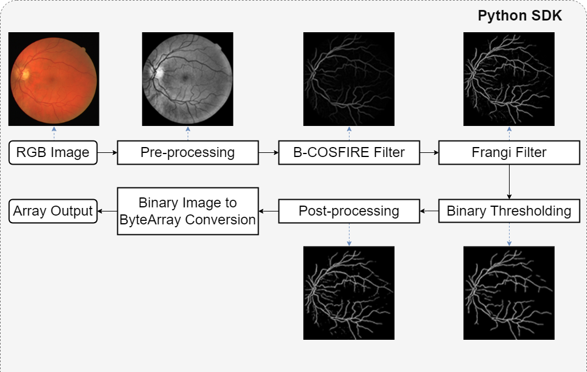
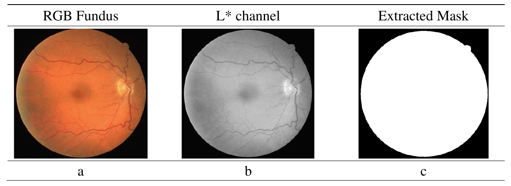
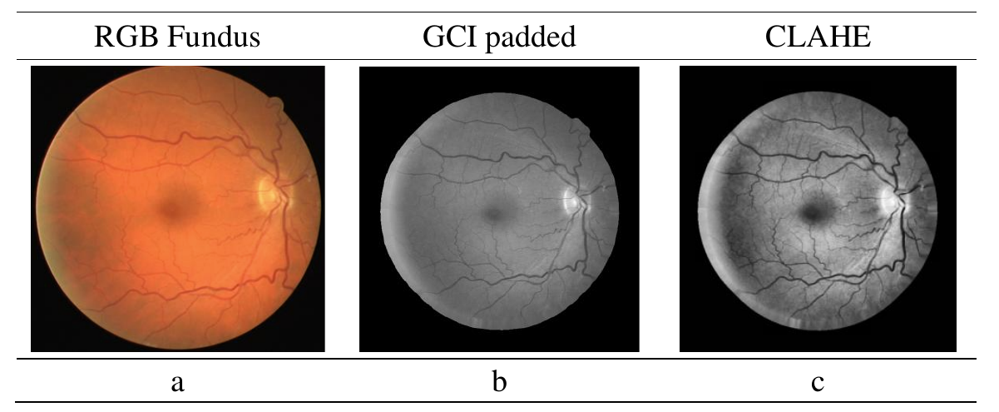
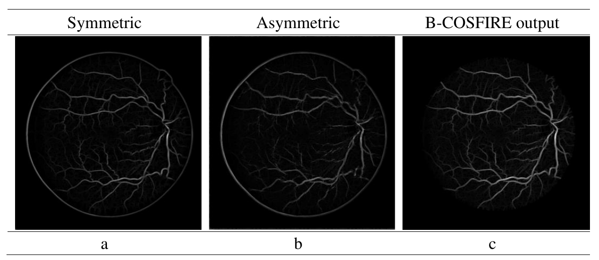

# Retinal Blood Vessel (RBV) Segmentation

## Problem

Manual analysis of fundus images to detect retinal blood vessels (RBV) is time-consuming, requires expertise, and prone to variability. Automated methods ensure consistent performance and can handle multiple datasets without human bias. While deep learning (DL) methods perform well, they require large annotated datasets and high computational resources. Traditional filter-based approaches are faster and less data-hungry but often struggle with smaller vessel detection.

## Approach

### RBV Overview

<p align="center">
  
</p>

### Preprocessing

* The RGB image is resized and converted to CIELab color space. The L channel of the LAB image is used to create a region of interest (ROI) mask. This mask is used to work with the white region (working regions) for BCOSFIRE and padding.

  ```python
  #convert resized fundus image into LAB color space
  Lab = color.rgb2lab(resized_RGB)

  #Extracting the L channel
  L = Lab[:, :, 0] / 64
  #Binarizing the ROI mask
  th = filters.isodata(L) * threshold_offset
  roi_mask = (1 - ( L < th))

  #cleaning the ROI mask with morphology close and open.
  cleaned   = filters.bwareaopen(roi_mask.astype('bool'), minSize = 500)
  cleaned   = 1 - cleaned

  i_cleaned = filters.bwareaopen(cleaned.astype('bool'),  minSize = 500)
  roi_mask  = ~(i_cleaned.astype('bool'))
  ```

  <p align="center">
    
  </p>

* The green channel image (GCI) is extracted and used for the actual processing due to its higher contrast. The GCI is padded and expanded slightly with *filters.getBigimg2()* method. Then CLAHE is applied on this GCI padded image to furhter increase the image contrast.

  ```python
  green_channel = resized_RGB[:,:,1]
  gci_image, gci_mask = filters.getBigimg2(green_channel, roi_mask, pad_size = 50)
  ```

  <p align="center">
    
  </p>

### Feature Extraction – B-COSFIRE

* The preprocessed CLAHE image and the extracted ROI mask is passed to the B-COSFIRE filter (Bar Combination of Shifted Filter Responses) for vessel extraction.
* The filter combines symmetric and asymmetric filter responses to enhance vessel structures.
   <p align="center">
    
  </p>
* [Reference: Azzopardi et al., 2015, *B-COSFIRE: A trainable filter for line pattern recognition*]

### Feature Extraction – Frangi

* Apply Frangi filter on the inverted B-COSFIRE output.
* Enhances smaller vessel structures using eigenvalues of the Hessian matrix.
* Parameters (alpha, beta, gamma, scale) tuned based on B-COSFIRE settings.
  *(Insert image: Frangi output)*

### Postprocessing

* Combine outputs from B-COSFIRE and Frangi filters.
* Binarize the image and remove noise/artifacts to obtain the final vessel map.
  *(Insert image: Final vessel segmentation overlay)*

## Results

| Dataset | Sensitivity | Specificity | Accuracy |
| ------- | ----------- | ----------- | -------- |
| DRIVE   | —           | —           | —        |
| STARE   | —           | —           | —        |
| HRF     | —           | —           | —        |

*The proposed method achieves a good balance of sensitivity and specificity while improving true vessel detection, comparable to deep learning approaches and higher than most past non-DL methods.*

## Visuals

* All images referenced above are to be inserted inline where mentioned. No source code or implementation details are included, only the methodology and outputs for portfolio presentation.
